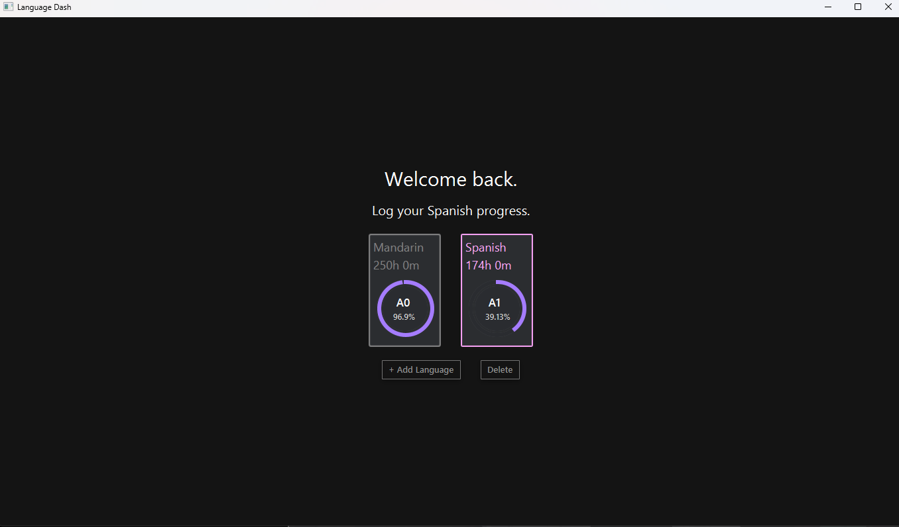
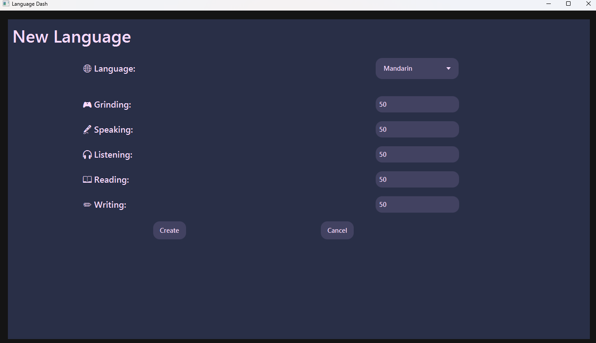
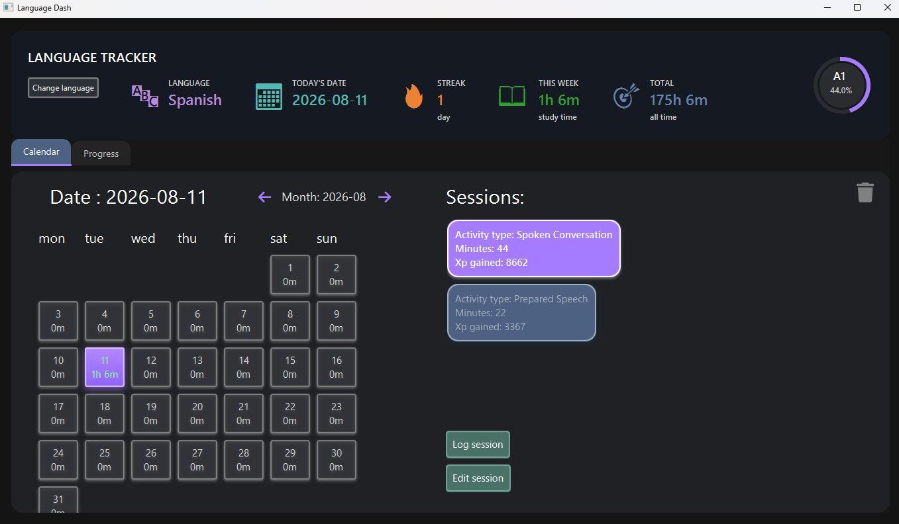
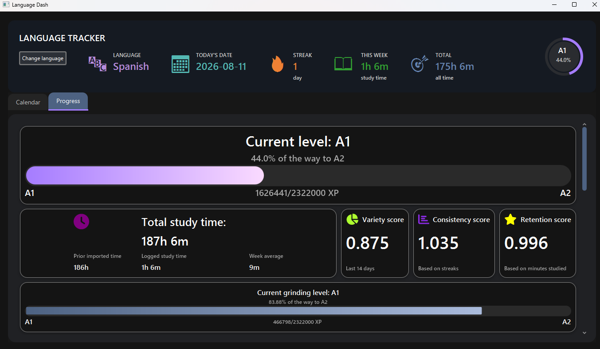
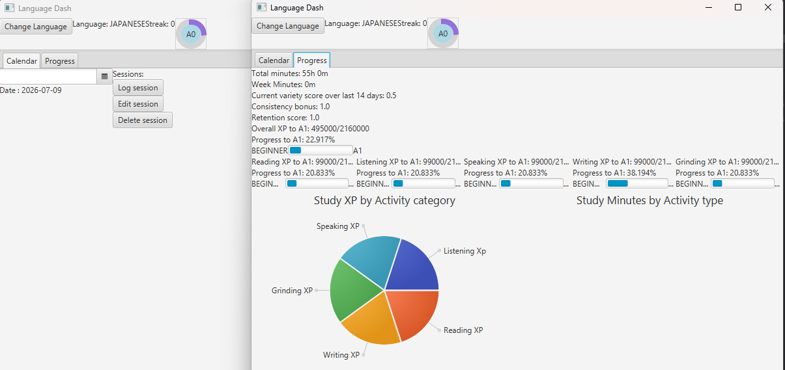

# Language Dash

Language Dash is a JavaFX desktop application for tracking language study sessions, visualising progress, and staying motivated through a gamified XP system.

It supports multiple languages, calendar-based study history, CEFR-style progression, statistics dashboards, and persistent JSON storage.

The project was built as a personal learning project to practice Java, JavaFX, UI architecture, persistence, and software design as a whole.

## Features

*  Custom calendar view with daily study cards
*  Log, edit, and delete study sessions
*  Support for multiple languages
*  CEFR-style progression from A0 to C2
*  XP system based on study time, consistency, and variety
*  Progress dashboard with charts and progress bars
*  Streak and study statistics tracking
*  Automatic JSON persistence
*  Custom dark-themed JavaFX UI

## Screenshots

### Main Menu

### New Language Menu

### Calendar View

### Progress Dashboard

### UI Evolution

## Running the Application

### Requirements

* Java 21 or later
* JavaFX SDK

### Run from an IDE

1. Clone the repository.
2. Configure JavaFX as a library dependency.
3. Run `Main.java`.

## What I Learned

This project evolved from a simple study tracker into a full desktop application. Through building it I learned:

* JavaFX layout management (`BorderPane`, `GridPane`, `VBox`, `HBox`, `ScrollPane`)
* reusable page-based UI architecture
* state management and refresh logic
* JSON persistence and data synchronisation
* CSS styling and pseudo-classes
* debugging and refactoring a growing codebase
* Maven dependency management, including adding and managing external libraries such as Ikonli
* Designing and using Java enums effectively for activity types, activity categories, CEFR levels, and supported languages, which helped improve type safety and reduce hard-coded string logic

Current Status

Version 1.0.0 – functionally complete and undergoing real-world testing and minor bug fixes.